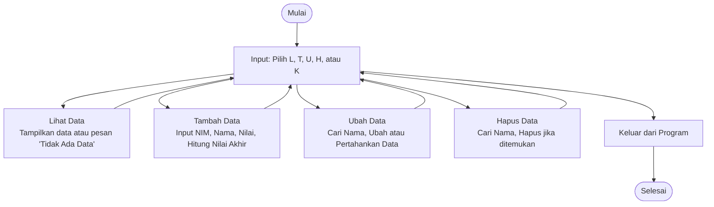

## UASPEMROG

## Link penjelasan youtube

https://youtu.be/jefY0lxtow4

## Kelas Mahasiswa
Kelas ini berisi atribut dan metode untuk mengelola data mahasiswa.

## Atribut:

data_mahasiswa: Dictionary untuk menyimpan data mahasiswa, dengan NIM sebagai kunci dan nilai berupa dictionary yang berisi informasi mahasiswa (nama, nilai tugas, UTS, UAS, dan nilai akhir).
Metode:

## __init__: Inisialisasi objek dan atribut data_mahasiswa.
lihat_data: Menampilkan daftar mahasiswa. Jika data kosong, akan muncul pesan "TIDAK ADA DATA".
tambah_data: Menambahkan data baru ke dalam data_mahasiswa. Menghitung nilai akhir berdasarkan bobot:
Tugas: 30%
UTS: 35%
UAS: 35%
ubah_data: Mengubah data mahasiswa berdasarkan nama. Data yang bisa diubah meliputi NIM, nama, dan nilai.
hapus_data: Menghapus data mahasiswa berdasarkan nama.
Program Utama
Program utama menggunakan loop untuk menawarkan opsi kepada pengguna:

(L)ihat: Memanggil metode lihat_data.
(T)ambah: Memanggil metode tambah_data.
(U)bah: Memanggil metode ubah_data.
(H)apus: Memanggil metode hapus_data.
(K)eluar: Keluar dari program.
Pengguna memberikan input berupa huruf untuk memilih aksi yang diinginkan. Program akan terus berjalan hingga pengguna memilih opsi "K".

## Contoh Interaksi
Menambah Data:

Input nama, NIM, dan nilai.
Data akan disimpan dengan nilai akhir dihitung otomatis.
Melihat Data:

Menampilkan daftar mahasiswa dalam format tabel.
Mengubah Data:

Pilih nama mahasiswa yang ingin diubah.
Masukkan data baru, atau tekan Enter untuk mempertahankan nilai lama.
Menghapus Data:

Pilih nama mahasiswa yang ingin dihapus.

